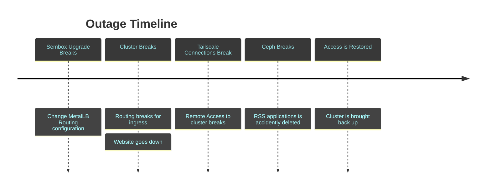

# Analyzing an Outage
I don't have a ton to post about recently, but I realized it would be interesting to analyze why I had an outage and the instabilities in my system.

I also just want to document this process (I don't plan to do a good one, that would take too much time).

## Incident Summary
On September 23rd, I brought down my cluster while trying to change the networking policies to try and fix an issue with my [sembox project](https://sembox.sachiniyer.com/) (it is currently down, but I am working on bringing it up). Somehow I broke my MetalLB configuration, and brought down my Traefik Ingress in the process. This meant that no more traffic was traveling to my cluster.

## Impact
I think my applications were down for about a week. I did not have time to dive and fix the cluster. My main website was down for about 20 minutes, and I quickly brought up an ec2 instance and just rerouted traffic there to mitigate the impact. All in all, I think I took the correct actions to mitigate the majority of the impact while keeping up with work/other responsibilities. 

I also accidentally unplugged some of my ssds while rebooting the computers. Then I went on a side tangent of not realizing my ssds were unplugged and trying to fix ceph. I deleted my rss application's pvc during this.

Impact in bullets:
- Main website down for 20 min
- Other applications down for a week
- RSS application has data deleted
- I didn't sleep a ton on the day of the fix :dizzy_face:

## Timeline



## Metrics
Lol, metrics. Don't have any of those. The only metrics I have are my (bad) commit messages:
```
commit a38602649828a9913ae526397bb30d45ae42a6a2
Author: Sachin Iyer
Date:   Fri Oct 4 21:25:45 2024 -0700

    remove outage message

commit 32296a197d02476133741d798a5bb68fe3e856aa
Author: Sachin Iyer
Date:   Mon Sep 30 19:19:30 2024 -0700

    add up message

commit 8936ef9af24c63374856abc3933406d66259d8b5
Author: Sachin Iyer
Date:   Mon Sep 23 20:05:43 2024 -0700

    add down message
```

## Incident Questions
Yup, I am not answering this either, my cluster is super unstable (semi-intentionally). Here are the common ones though:

    Detection
        When did you learn there was customer impact?
        How did you learn there was customer impact?
            Reported by the customer
            Identified by monitoring and/or alerting
        How can we reduce the time-to-detect in half?
    Diagnosis
        What was the underlying cause of the customer impact?
        Was an internal activity (maintenance window)happening during the incident?
            Was the MW properly announced?
            Did the service owner know about the MW?
            Is there a task in the backlog to remove the dependency?
                Why wasn’t it implemented?
        How can we reduce the time-to-diagnose in half?
    Mitigation
        When did customer impact return to pre-incident levels?
        How does the system owner know that the system is properly restored?
        How did you determine where and how to mitigate the problem?
        How can we reduce the time-to-mitigate in half?

## 5 Whys
#### Why 1
**Q:** Why did the site go down?

**A:** I broke my Ingress and my MetalLB configuration.

#### Why 2
**Q:** Why did I break my Ingress and MetalLB configuration?

**A:** I was trying to set a NodePort for my sembox application, and accidentally broke something in the MetalLB configuration.

#### Why 3
**Q:** Why was I trying to set up a NodePort?

**A:** I was having issues with resolution to the database from the backend, and was going to see if setting a NodePort would fix this. Reflecting on my plan, I know realize that it carries some security risk tbh.

#### Why 4
**Q:** Why was I having issues with resolving to the database?

**A:** I think this is because there was authentication issues, I am still yet to find some time to figure out the root cause.

#### Why 5
**Q:** Why were there authentication issues?

**A:** Because this is my blog, and I decide what to write, I'm going with a hard :shrug:.

## Action Items
I am only taking one, don't do major configuration changes when you have work the next day. Do it over the weekend :facepalm:.
