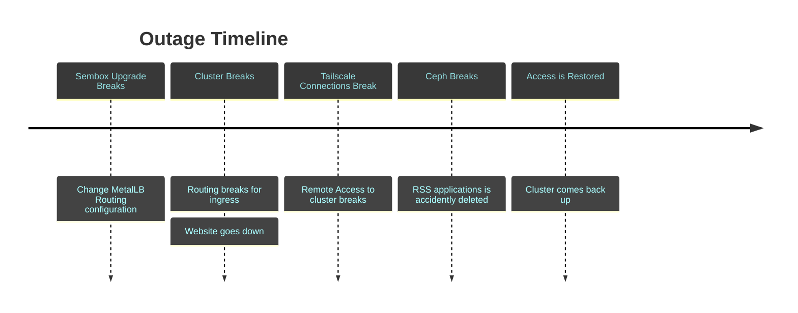

# Analyzing an Outage
I don't have a ton to post about recently, but I realized it would be interesting to analyze why I had an outage and the instabilities in my system.

## Timeline

```mermaid
%%{init: { 'logLevel': 'debug', 'theme': 'default' , 'timeline': {'disableMulticolor': true}, 'themeVariables': {
          'cScale0': '#383838', 'cScaleLabel0': '#93e0e3', 
          'cScale1': '#383838', 'cScaleLabel1': '#cc9393',
          'cScale2': '#383838', 'cScaleLabel2': '#f0dfaf',
          'cScale3': '#383838', 'cScaleLabel3': '#7f9f7f'
   } } }%%
timeline
 title Outage Timeline
   Sembox Upgrade Breaks : Change MetalLB Routing configuration
   Cluster Breaks : Routing breaks for ingress : Website goes down
   Tailscale Connections Break : Remote Access to cluster breaks
   Ceph Breaks : RSS applications is accidently deleted
   Access is Restored : Cluster comes back up
```

## Why was 
