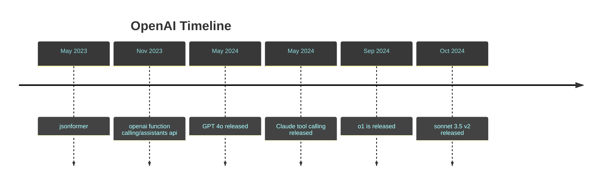

# Really?

Yes. I quit my job and am joining [detail](https://detail.dev). I think we are on the verge of a new class of applications[^new-apps] that were not possible previously. There is a new interface between machines and the environment. Models can call into [functions](https://docs.anthropic.com/en/docs/build-with-claude/tool-use) and interact meaningfully with the real world. Combine that with the ability to [reason](https://arxiv.org/html/2305.10601v2)[^test-time], and this is a new primitive[^primitive].

Let's say that I want to cut into the doordash pie[^meal-finder] :wink:, and create an application that uses a chatbot interface to help people find their dinner[^date]. I can hook it up to a bunch of sources[^meal-finder-sources] and get conversations like:

_USER_
> what is the best dosa near me

_ASSISTANT_
> For a delicious dosa experience in the Seattle area, I recommend House Of Chettinad located at 1525 13th Ave, Seattle, WA 98122. They specialize in South Indian cuisine and are known for their authentic dosa offerings.
> 
> You can find more information on their website: [House Of Chettinad](https://houseofchettinad.us/).

This might look like a normal ChatGPT conversation, but there are semantics that make it interesting.
- The model got my location through a cache in my browser
- **House of Chettinad** is, in my opinion, better than the first 10 google maps[^dosa-maps] results
- The sources[^meal-finder-sources]/tools informed the models's choice of restaurant

## Why am I making this post?

Honestly, it caught me off-guard, but I don't think that is the case for everyone. [YC](https://www.youtube.com/watch?v=ASABxNenD_U) seems to be on top of it. Anthropic has [a blog post](https://www.anthropic.com/research/building-effective-agents) on how to do it well. It seems like there is a lot of VC money going into this[^vc-money]...

Similar things happened with crypto, so I took the same approach but creating a project in the space[^moxie-crypto] to cut out the noise. Dissimilar to crypto, the projects I created absolutely shock me by their potential value. Creating a project you can see being valuable is extremely galvanizing[^dark-forest].

# Why isn't this tech in my life now?

### Recency

[@datnguyennx](https://github.com/datnguyennnx) has a good summary of [the timeline](https://memo.d.foundation/playground/01_literature/history-of-structured-output-for-llms/)

Also check the [Berkeley Function-Calling Leaderboard](https://gorilla.cs.berkeley.edu/leaderboard.html) for performance metrics (init Aug 2024)[^gorilla].

### Technical Challenges

Let's say we have a great model that can do tool use almost perfectly. There is still a bunch of technical challenges with integrating the model into the environment.

- **Managing data**: Dumping your entire API response into the model won't give you optimal performance. Here are a couple potential optimizations:
  - How do you manage IDs[^id-words]?
  - What pieces of data are most important for the model?
  - How do you present that data[^data-present]?
- **Utilizing Tools**: How can you ensure the model utilizes all the information available to it[^claude-force]
- **Latency**: Tool use can [take a while](https://github.com/sachiniyer/tool-call-benchmark). How do you reconcile your requirements?[^async-tool]
- **Verification**: Can you let the model work against a deterministic component?[^order-verify]
- **Model Strategy**: Can you apply different sizes/types of models to different problems?[^spec]
- **Observability**: In your new system, where are the failure points?

And so many more...

### Model Cost

Models cost a lot[^detail-cost]. However, I believe that inference costs (and latencies) will have a race to the bottom.
- [Bedrock Inferentia](https://www.aboutamazon.com/news/aws/amazon-nova-artificial-intelligence-bedrock-aws) and [Google Trillium/TPU](https://www.hpcwire.com/2024/11/05/google-cloud-sporting-a-new-look-in-hpc-and-ai-hardware/)
- Many, many ASIC companies[^asics]
- Better [inference software](https://blog.sachiniyer.com/posts/11/)[^ray-k8s]
- Power costs through Nuclear?[^three-mile]
- Model commoditization ([deepseek](https://www.unite.ai/how-deepseek-cracked-the-cost-barrier-with-5-6m/))

### More?

Dude, these are new primitives[^primitive]. Commercial apps are just being built. LLMs make for great demos, and I can only assume there is a ton more last mile engineering to get through.

# What is next?

### Write an app

:warning: **CREATE AN APP!** :warning:

Use any of the APIs ([openai](https://platform.openai.com/docs/assistants/tools/function-calling), [bedrock](https://aws.amazon.com/bedrock/agents/), [anthropic](https://docs.anthropic.com/en/docs/build-with-claude/tool-use#example-of-a-good-tool-description), [langchain](https://python.langchain.com/v0.1/docs/modules/agents/)...) and spin up a quick app. Do a [convicion startup idea](https://www.conviction.com/startups.html), Jared Friedman says [choose a sass company to replace](https://www.youtube.com/watch?v=ASABxNenD_U), or automate a part of your life[^automation-agent]

Going from nothing to something requires no deep ML knowledge, no crazy system knowledge, and no insane techniques. My 10th grade self with basically just arduino programming experience could build something of value.

### The future

Commercial apps are just being created/released. I truly believe the hype is warranted, and this tech is going to create great value in the future. [Cursor](https://www.cursor.com/) and [Perplexity](https://www.perplexity.ai/) are already in my life every day.

An exercise I have been doing is to compare this to the internet era. I believe they are comparable (and I'll probably write a blog post exploring the comparison).

[^new-apps]: [sierra](https://sierra.ai/), [camfer](https://www.camfer.dev/), [cognition](https://www.cognition.ai/) as just 3 of the many many great companies
[^test-time]: [Test time compute](https://arxiv.org/html/2408.03314v1) in models like [o3](https://en.wikipedia.org/wiki/OpenAI_o3) is one of the recent pieces of tech enabling this
[^primitive]: Thanks [Tony Kam](https://www.linkedin.com/in/tonyshekkam/) from [lilac labs](https://www.drive-thru.ai/) for the terminology
[^meal-finder]: I actually wrote this [recently](https://github.com/sachiniyer/meal-finder/tree/master)
[^date]: I did this with the app and had a great date at [kedai makan](https://www.kedaimakansea.com/) with my [girlfriend](https://ilyxandra.com/)
[^meal-finder-sources]: I did this with [google maps api](https://developers.google.com/maps/documentation/places/web-service/details), [yelp api](https://docs.developer.yelp.com/docs/fusion-intro), [exa](https://exa.ai/), and a couple more pieces
[^dosa-maps]: Taste of Mumbai, Chennai Express Authentic Indian, Babai Dosa, The Bangalore Kitchen, Dosawaala, Sangamam, Spice Bliss, Madras Dosa Corner, Dosa House (I actually might choose Dosa House over House of Chettinad, but both are great)
[^vc-money]: I don't know how to find good sources on this but [this guy](https://www.vccafe.com/2024/11/09/the-ai-services-revolution-why-vcs-are-betting-big-on-agentic-ai/) agrees with me
[^moxie-crypto]: This is inspired by [moxie](https://moxie.org/2022/01/07/web3-first-impressions.html) who I recently saw on a plane (celebrity shock)
[^gorilla]:  The [gorilla project](https://gorilla.cs.berkeley.edu/) (which created BFCL) has a ton of useful information about function calling/tool use.
[^dark-forest]: I did an internship at dark forest to cut out the crypto noise, but was not nearly as shocked. 
[^timeline-links]: [jsonformer](https://github.com/1rgs/jsonformer), [openai function calling](https://openai.com/index/new-models-and-developer-products-announced-at-devday/), [gpt-4o](https://community.openai.com/t/gpt-4o-openai-spring-product-announcements-2024/742070)
[^id-words]: Would a [three-random-words](https://www.ncsc.gov.uk/collection/top-tips-for-staying-secure-online/three-random-words) method work better than UUIDv4s?
[^data-present]: Structured data (e.g. json) vs unstructured seems to be an open question so far
[^claude-force]: You can [force claude](https://www.anthropic.com/news/tool-use-ga) to use a specific tool
[^async-tool]: Can you use [async tool calling](https://arxiv.org/abs/2412.07017v1)?
[^order-verify]: I did this [in this app](https://github.com/sachiniyer/order-assistant/blob/master/src/menu.rs) and got great results
[^spec]: Techniques like [speculative decoding](https://philkrav.com/posts/speculative/) or [task specific selection](https://github.com/sachiniyer/meal-finder/blob/master/backend/services/image_processor.py)
[^detail-cost]: I once spent $40 in a day just developing/testing an app.
[^asics]: [Etched](https://www.etched.com/), [Tenstorrent](https://tenstorrent.com/en), [Groq](https://groq.com/), [Chipflow](https://www.chipflow.io/), [Taalas](https://taalas.com/), [Cerebras](https://cerebras.ai/), [SambaNova](https://sambanova.ai/). Check out [artificial analysis](https://artificialanalysis.ai/) to see who is on top.
[^ray-k8s]: There has to be a better way than just deploying [vllm](https://blog.vllm.ai/2023/06/20/vllm.html) containers on kubernetes. Sources - [anthropic](https://youtu.be/b87I1plPeMg?si=Gshn9veXakyU6fnp),  [openai](https://openai.com/index/scaling-kubernetes-to-7500-nodes/), bedrock - I used to work there
[^three-mile]: microsoft is reopening [three mile island](https://www.bbc.com/news/articles/cx25v2d7zexo)
[^automation-agent]: [Superhuman](https://superhuman.com/) make my emacs email automation somewhat obsolete
