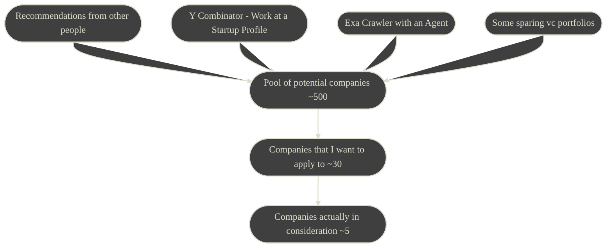

# Preface

Posting about getting into companies is a tricky topic for me. Back in Apr 2023[^post1], I said my goal with this blog was:

> My goal is only post about things that I will find useful for future me (and which therefore may be useful to you).

I will try not to brag or stroke my ego, but provide information that is valuable to future me. If you think I crossed the line, let me know, and I will adjust my language. If you want more specifics, [contact me](https://sachiniyer.com/contact).[^contact]

---

# My Target Company

This is a lot more personal than I usually intend this blog to be, however my target company is obviously the basis for my entire application process.

## The People

At the start, I undervalued working with pleasant people. If I am planning to spend at minimum 8 hours a day with them, they have to be cool. 

This is a fully vibes-based requirement. A company's onsite is a great time to figure whether the team is chill.[^chill]

I also think good people are more likely to do good in general. I want to work with/for good people :smile:.[^goodpeople]

## The Problem
I want interesting problems.

Copying from my [recurse application](https://github.com/sachiniyer/rc-application/blob/master/questions.org#what-do-you-want-to-be-doing-in-two-years)[^recurse], interesting problems look like the following to me

> Interesting project/product to me is:
> - Technically interesting - I need to satisfy my urge to solve puzzle-like problems
> - Brings value - giving people something of value and doing general worldly good improves my self-worth
> - Something I have passion for - a base emotional connection from a variety of factors (definitely the most fuzzy qualification)
>
> Interesting project/product to me does not require (assume disjunction):
> - Purely technically challenging
> - Generating large monetary returns
> - Attached to lots of prestige
> - In a defined area of tech (e.g. machine learning)

## The Company

There are two dimensions to classify companies by that are important for me - company size and Product/market fit.[^dimensions]

### Company Size

| Size            | Description                    | Example                |
|:----------------|--------------------------------|------------------------|
| 1 - 2           | Founding a startup             | New YC Company         |
| 2 - 10          | Small Startup                  | https://detail.dev     |
| 10 - 100        | Mid-size Startup/Small Company | https://perplexity.ai  |
| 100 - 1,000     | Medium Size Company            | https://huggingface.co |
| 1,000 - 100,000 | Big Tech                       | https://amazon.com     |

I decided that I wanted to join a **Small Startup**[^small] (having just come away from Big Tech[^big]).

### Product/market Fit

Marc Andreessen coined the term[^pmf] as:

> Product/market fit means being in a good market with a product that can satisfy that market.

|                 |                                                                          |
|-----------------|--------------------------------------------------------------------------|
| **Stage:**      | Before Product/market Fit                                                |
| **Definition:** | No defined product or a market to satisfy, _yet_                         |
| **Example:**    | https://detail.dev, https://www.meta.com/quest/, and most startups today |
|                 |                                                                          |
| **Stage:**      | Achieving Product/market Fit                                             |
| **Definition:** | Validation of market, product goes from 0 to 0.5/1                       |
| **Example:**    | https://perplexity.ai and https://azure.com                              |
|                 |                                                                          |
| **Stage:**      | After Product/market Fit                                                 |
| **Definition:** | Scale until you fill your market, product goes from 1 to 100             |
| **Example:**    | https://aws.amazon.com and https://irealpro.com                          |

Company size weakly correlates (but does not causate) Product/market fit. For example, I would argue that https://twitter.com has not really achieved Product/market fit. Additionally, these are very subjective classifications.

I want to create something from the ground up, and therefore I need to join something that is **Before Product/market Fit**[^dan]

## The Role

It is disingenuous to say that I don't want to be the center of the action. Ultimately, I want to be the one who gets to solve the hard problems and architect[^mmm]. I also want to be the person entrusted to do the janitorial work.[^janitor]

Qualifying those statements is difficult, here is a list of examples:

|                                       Good | vs | Bad                                  |
|-------------------------------------------:|----|:-------------------------------------|
|                       Help define a design |    | Given a design to implement          |
|   Given problems important to the business |    | Hand-held with softball problems     |
|                      Given Janitorial Work |    | Never given janitorial work          |
|          Ownership over service components |    | Job is just solving disjoint tickets |
| Involved in the prioritization of problems |    | Told what to do without consultation |

## Red Flags

There are a few Red Flags that can disqualify a company for me (I very rarely saw this)
- Low Compensation/Equity
- Weird Company Setup
- Over-indexing on specific tech stacks
- Egregious over-valuation

...and any other weird stuff

# Application Process

## Finding Companies

The goal is get into companies similar to "My Target Company", which means I have to consider companies that I haven't heard of before.

What I would have done differently:
- Create a bigger pool (~1000) and maybe do the first pass with an LLM
- More recommendations from people that I know
- Put observability into the process (instead of just a random org-mode list)
- Apply to even less companies (or at least ladder the applications by preference)

## Applications

I did not do any referrals or LinkedIn messaging. I really just applied through the forms/interview process on the company websites.

## Interviews

The interview styles of companies were actually somewhat different. I will describe four interview processes I had.

##### Style 1 - The Classic

1. 15m - Basic screening round
2. 30m - Tech screen round(s) with leetcode or classic system design
3. 90m - Some combination of behavioral rounds with members of the team
4. 6h - Onsite with system design question/behavioral conversations
4. Offer

##### Style 2 - The Take-home

1. 15m - Basic screening round
2. 72h - A take-home that spans 1-3 days
3. 6h - Super Day - some combination of behavioral or tech rounds (in-person or virtual)
4. Offer

##### Style 3 - The Onsite Project

1. 15m - Basic screening round
2. 30m - Tech screen round(s) with a leetcode-ish problem
3. 8h - Onsite, but it's just a project that spans the day
4. Offer

##### Style 4 - The FAANG

1. 1h - Tech screen round with leetcode problem (async)
2. 30m - Tech interview with leetcode or classic system design
3. Offer

##### Style 5 - What I would do :star: 

1. 45m - Basic screening round - Screen the candidate and make sure they don't waste their time on a take home
    - 15m - Background questions
    - 30m - Dive into one of their projects
2. 48h - Two day open-ended takehome (the classic - create our company's product) - Make sure they can code and create something and publish it into the real world.
3. 4h - Quick in-person onsite with pair-programming round/meet the team - Make sure they are good people and convince them to join the team. Also check for red flags.

## Compensation Conversation

Compensation was not a major decision factor for me. The only question I asked was "is there an opportunity for more equity" to every offer. I believe in tying my incentives with the company, and taking an equity heavy offer was a good way to do that.

# Decision Process

I am very thankful to have gotten into way more places than I would have guessed. I was lucky enough to turn down opportunities that, in isolation, I would have accepted in a heartbeat.

The decision process was very difficult; harder than choosing which college to go to.

## Asking for Advice

Advice from friends and family is actually quite noisy. There is a pretty heavy bias towards companies they know/that have clout. In my opinion, low acceptance rates are not a good reason to enter a company. Additionally, my preference to **Small Startup** meant that recognition may not be what I want.

However, if someone is willing to give you the time to maintain context through the application process, their input can be very valuable.

## The Questionnaire

I ended up making my final decision by essentially rephrasing my target company into a questionnaire that I filled out for each of my options.

| Company Growth                  | Personal Growth                   | Career Growth        |
|:--------------------------------|:----------------------------------|:---------------------|
| Short term and long term plans? | How do Peer Relationships look?   | Clout?               |
| How are investors?              | How do Mentor Relationships look? | Position in company? |
| Team competency?                | What role will I have?            |                      |
| Commitments to other companies  | Are the problems interesting?     |                      |
| Strength of existing tech       |                                   |                      |

I gave each of the questions a score and did not equalize the weighting for each of the categories (e.g. I care less about **Career Growth** than **Personal Growth**). Through that I came up with my final decision.

---
# Postface

This post is very different from my other posts, however I think it still ties to the goal of providing information to my future self. I hope I take the following away:

- If I need to search for a job again, understand what techniques worked/didn't work
- Record the application/decision making frameworks I created for the future
- If I need to create an interview cycle, I can draw from my learnings in this experience
- I want to post mortem this decision later (for positive or negattive reasons)

[^post1]: [My first post on this blog](https://blog.sachiniyer.com/posts/1/)
[^recurse]: [recurse center](https://www.recurse.com/) is an unstructured 6/12 week retreat for programmers
[^contact]: I'd be happy to de-anonymize all the information in this post and go into specifics about what the process looked like
[^chill]: The best times on the onsite seem to be during lunch or dinner (which companies will often pay for)
[^goodpeople]: In some ways I think this is actually the most important component. I want to work with people who share my values. To do good things in the world, I believe I have to parter with people who also want to do good things in the world.
[^dimensions]: There are obviously a lot more dimensions to index on, however I think this is the most important two. Some others are; funding, prestige, location, and many more.
[^small]: Small companies have a lot going for them. The right ones have a small group of high performers, which can be a great place to work. They are also more willing to dig deeper into your background and give you an outsized role.
[^janitor]: [Jantorial Work](https://ferd.ca/code-janitor-nobody-s-dream-everyone-s-job-and-how-erlang-can-help.html) is some of the most important work at the company. A balance of cool new shiny stuff with janitorial work means that you are an integral part of the system. I want a role with janitorial work.
[^pmf]: coined in [his blog](https://pmarchive.com/guide_to_startups_part4.html)
[^dan]: My future employer really convinced me of this. I want to be the one helping define the [ethos](https://en.wikipedia.org/wiki/Ethos) of a place, rather than sitting inside the already existing machine.
[^mmm]: "Architect" as defined by [Mythical Man-Month](https://en.wikipedia.org/wiki/The_Mythical_Man-Month). They are the nucleus of the project/feature driving it to success.
[^big]: My previous job was for Amazon. Check out my [resume](https://sachiniyer.com/resume) if you care for detailed info.
