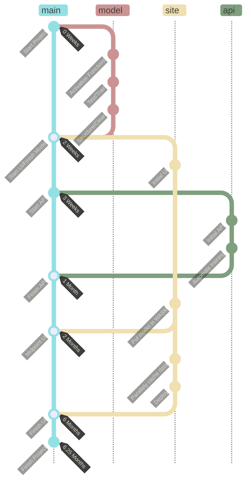

# Introduction

I created a [Neural Net](https://en.wikipedia.org/wiki/Artificial_neural_network) that sits in your browser[^browser] to detect handwritten digits[^digits] (primarily from the [MNIST data set](http://yann.lecun.com/exdb/mnist/index.html)). This is built with [rust](https://www.rust-lang.org/) and compiled to [WebAssembly](https://webassembly.org/) to run with some speed[^speed].

## Links

### [main link](https://digits.sachiniyer.com)

probably want to train a bit before trying an example

#### Other Links
- [repository](https://github.com/sachiniyer/mnist-wasm)
- [api](https://digits-api.sachiniyer.com)

# What is this?

## Architecture
```goat
+------------+
| Website    |              +-----+                              
| +-------+  +--------------+ API |
| | Model |  | Weights/Data +-----+
| +-------+  |
+-----+------+
```

## Model
[code](https://github.com/sachiniyer/mnist-wasm/tree/master/model)

The model has the following features
- 1 layer of ReLU
- 1 layer of LogSoftmax
- Written in Rust only with the help of the [ndarray](https://docs.rs/ndarray/latest/ndarray/) package
- Optimized for single sample and batch training

## Website
[code](https://github.com/sachiniyer/mnist-wasm/tree/master/site)

The website has the following features and more:
- Built with the [yew](https://yew.rs/) framework
- Training of the model in a parallel web worker
- Pre-cached samples with async replenishment
- Loading of samples on-demand for inference
- Grid to draw your own digit
- Various inputs to tune the training and inference

## API
[code](https://github.com/sachiniyer/mnist-wasm/tree/master/api)

The api has the following features and more:
- Load an MNIST sample
- Load a block of MNIST samples
- Getter and Setter for Model weights

# How did this happen?

- **2 Weeks:** I want to build a Neural Net with Rust as a learning experience[^karpathy]. It will be interesting to implement the activation functions and backpropogation.
- **1 Months:** Rust and WASM play nice, would it be possible to put the model on the web.
- **2 Months:** If I put this on the web, then I better use Rust for the rest of the website functionality.
- **6 Months:** If I have a website, I better be able to train it, cache effectively, and run this in parallel[^webworker] to the rendering



Everyone, this is what we call _scope creep_.

# What is next?

I will be creating 3 more posts:

### [Part 2](/posts/8)

Details about the model with a little bit of math and code

### [Part 3](/posts/9)

Details about the frontend, and how I was able to jam in all the features I desired

### Part 4
Details about the api, deployment, and integration

[^browser]: By this, I mean the computations and model all run on your machine, instead of some server somewhere. This is also known as running client side.
[^digits]: Trained on digits written by Census Bereau Employees and high-school students [source](http://yann.lecun.com/exdb/mnist/index.html)
[^speed]: Not a ton of speed...but some speed.
[^karpathy]: This is heavily inspired by [covnetjs](https://cs.stanford.edu/people/karpathy/convnetjs/index.html)
[^webworker]: And complicate everything by using [web workers](https://developer.mozilla.org/en-US/docs/Web/API/Web_Workers_API)
