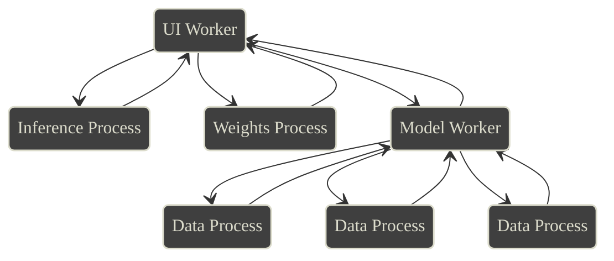
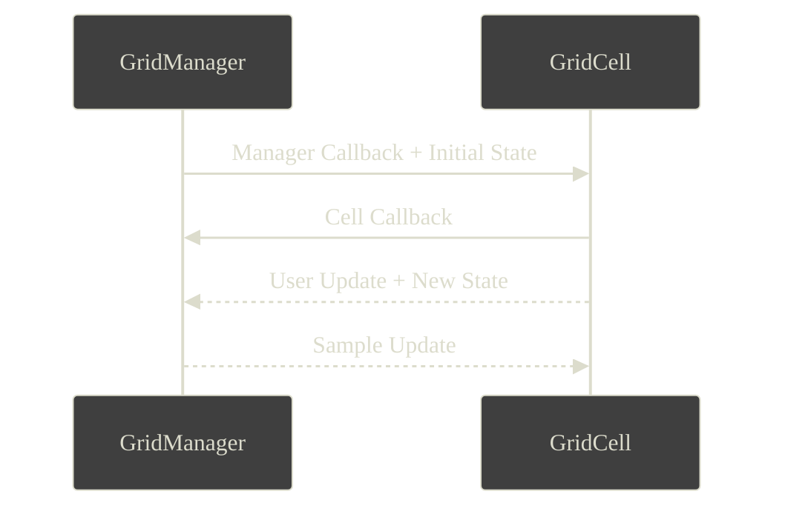
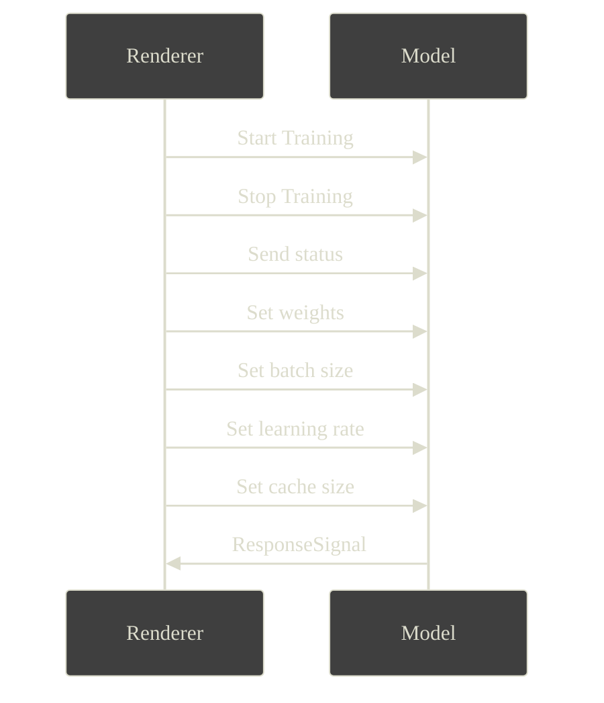

# Components

Main Components (organized by thread[^threads]):
- UI rendering and interaction
- Model training and inference



Essentially, the rendering thread offloads all model interaction to a [web worker](https://developer.mozilla.org/en-US/docs/Web/API/Web_Workers_API/Using_web_workers), which then spawns data processes[^spawnlocal] to replenish a cache of data that is then used to train the model. Inference is computationally light[^inferencethread] and done on the rendering worker directly. The tricky part is management of these workers/processes to create responsiveness in the UI while training efficiently.

## Places to Compute

### Web Workers
From [MDN Web Docs](https://developer.mozilla.org/en-US/docs/Web/API/Web_Workers_API)
> Web Workers makes it possible to run a script operation in a background thread separate from the main execution thread of a web application. The advantage of this is that laborious processing can be performed in a separate thread, allowing the main (usually the UI) thread to run without being blocked/slowed down.

Web workers are super useful, but creating communication channels can be confusing[^comm]. In an earlier version, I tried to do all my data caching in a separate web worker, but to simplify communication I decided to cache in a process. However, running the model in it's own web worker allowed rendering to run smoothly and independently.

### Processes

I created processes mostly with `spawn_local` from [wasm_bindgen_futures](https://rustwasm.github.io/wasm-bindgen/api/wasm_bindgen_futures/fn.spawn_local.html), which is very simply:

```rust
#[inline]
pub fn spawn_local<F>(future: F)
where
    F: Future<Output = ()> + 'static,
{
    task::Task::spawn(Box::pin(future));
}
```

`spawn_local` combined with an `async` closure (through `async move`) and a handle[^handle], allows you put some computations in the background and not block the main thread.

### Callbacks
[Yew Callbacks](https://yew.rs/docs/concepts/function-components/callbacks) essentially take a function, and attach to a dom element to run when there is user input/interaction. This is how any input propagates into the rust code/WASM.

# Main interface 
I used the [yew framework](https://yew.rs/). I think that the library itself was somewhat unstable[^yewstable]. Next time, I would do some sort of hybrid solution where I write the UI in JavaScript/Typescript and interact with WASM blobs as necessary.

## [Grid](https://github.com/sachiniyer/mnist-wasm/blob/master/site/src/grid.rs)

```goat
+------------------------------------+                                                                       
|  28 x 28        Manager            |
|                                    |
|    +------+  +------+  +------+    |
|    | Cell |  | Cell |  | Cell |    |
|    +------+  +------+  +------+    |
|                                    |
|    +------+  +------+  +------+    |
|    | Cell |  | Cell |  | Cell |    |
|    +------+  +------+  +------+    |
|                                    |
|    +------+  +------+  +------+    |
|    | Cell |  | Cell |  | Cell |    |
|    +------+  +------+  +------+    |
|                                    |
+------------------------------------+
```
The `GridCell` manage rendering and User input, while the `GridManager` manages overall state and sample loading. This is through a tangle of states and props[^react].



## Other stuff
I used [tailwind css](https://v1.tailwindcss.com/) by compiling in the css with [trunk](https://trunkrs.dev/assets/) and that is about it[^tailwind].


# Running the Model

## Training

### Communication


Where `ResponseSignal` is:
```graphql
type Weights {
    weights: (Vec<Vec<f64>>, Vec<Vec<f64>>)
}
type ResponseSignal {
    weights: Weights
    loss: f64
    acc: f64
    batch_size: usize
    lrate: f64
    data_len: usize
    data_futures_len: usize
    iteration: usize
    cache_size: usize
}

```
The `Model` worker waits for a signal from the `Renderer` worker, and responds with a `ResponseSignal`. If the `Model` worker is training, then it sends a `ResponseSignal` every iteration.

### Getting Data

The `Model` maintains an internal cache that is lazily replenished[^cache]. Every iteration (whether training or not), new futures are created to replenish the cache. If the model is training, but the cache is empty, then it delays that iteration[^delay].

The trick to bringing the data back into the `Model` worker is to send a handle along with the `spawn_local` as described earlier.

```graphql
type DataSingle {
    target: u8
    image: Vec<f64>
}
type Data {
    data: Vec<DataSingle>
}
type ModelData {
    data_vec: Arc<Mutex<VecDeque<Data>>>
}
```

In short, I spawn futures like this
```rs
for _ in 0..future_num {
    let data_vec_handle = self.data_vec.clone();
    spawn_local(async move {
        let data = get_block().await;
        data_vec_handle.lock().unwrap().push_back(data);
    });
}

```

Then I can hand the data and model to a small function to essentially just call a `train` function, and I update my model.

[^threads]: Threads in the sense of parallel processes. Everything runs on a single thread because it runs in your browser, however web workers are "threads"
[^spawnlocal]: Through the use of `spawn_local` in [wasm_bindgen_futures](https://rustwasm.github.io/wasm-bindgen/api/wasm_bindgen_futures/fn.spawn_local.html)
[^inferencethread]: also through `spawn_local` in [wasm_bindgen_futures](https://rustwasm.github.io/wasm-bindgen/api/wasm_bindgen_futures/fn.spawn_local.html)
[^comm]: Two reasons - you can only send JS types (objects need to be [Send and Sync](https://doc.rust-lang.org/nomicon/send-and-sync.html)) as well as through the [postMessage interface](https://developer.mozilla.org/en-US/docs/Web/API/Worker/postMessage) only
[^handle]: handle in the generic term could be a [yew state](https://yew.rs/docs/concepts/function-components/state), `Arc<Mutex<T>>`, or something else
[^yewstable]: I had to [pin to a specific commit](https://github.com/sachiniyer/mnist-wasm/blob/56051311a52f73c018de9077a1285a855e4fa5de/site/Cargo.toml#L17) to get the newest features without breaking my project every couple of weeks.
[^react]: Yew made this part especially hard, and I think I should have done it in React
[^tailwind]: I thought this would be much more painful than it was
[^cache]: Without a cache, you have to wait for the data to load every single iteration. One request runs in similar time as 5 parallel requests, so it was essential to parallelize.
[^delay]: The delay overhead is minimial, so it like polling until the data arrives (which waiting from signals from `Renderer` thread)
